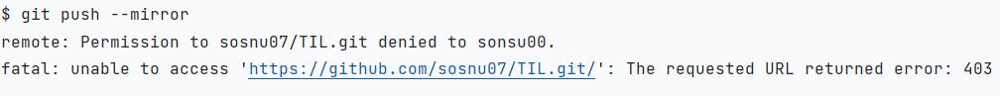

# 깃허브 저장소를 다른 계정으로 이전하기 

- 이왕 새로운 마음가짐으로 공부하기로 한거, 계정도 개발용으로 구글계정 하나 따로 파놨는데 아무 생각없이 이전계정에다가 계속 푸시올리고 있던걸 이제야 꺠달음..
- 좀 깔끔하게 하려고 이 레포지토리를 공유 - 클론 하려고 했더니 git에서 레포지토리 이전을 하는 방법이 따로 있다고 하여 기술. 

## 방법 [git repository mirroring]

- git repository를 커밋로그까지 포함하여 싸그리 다 옮기는 방법. 

**1. 원본 저장소(A)를 복사(mirroring)한다.**

   ```linux
   $ git clone --mirror 원본저장소 경로
   ```
   
   
**2. 클론한 디렉터리 내부로 이동**

```linux
$ cd 원본저장소 이름.git
```

**3. 새로 이동할 원격저장소(B) 경로 지정**

```linux
$ git remote set-url --push origin 이동할 원격 저장소
```

**4. 새 원격저장소로 push**

```linux
$ git push --mirror
```

**5. 어... 에러가 뜨네..?**



## 발생한 에러 

### remote.Permission.to 에러

- 방법으로는 SSH 키를 추가해서 해결하는 방법도 있고 HTTPS 만으로 해결하는 방법도 있다고 함
- 본 포스팅에서는 이런 어려운 방법을 거치지 않고 가장 쉽게 해결하는 방법을 쓰려고 함. 

- 레포지토리의 이전은 From sonsu00, to sonsu07 로 진행.

```linux
$ git push --mirror
remote: Permission to sosnu07/TIL.git denied to sonsu00.
fatal: unable to access 'https://github.com/sosnu07/TIL.git/': The requested URL returned error: 403
```

### 원인

- 에러 코드를 읽어보면 알겠지만 sonsu07[**기존 계정**]의 레포지토리에 대한 접근 권한이 sonsu00[**새로운 계정**]에게 없다고 뜬다.  
- sonsu00 계정이 sonsu07 계정에 접근할 권한이 없다는 것은 sonsu07 계정 어딘가에 sonsu00 계정에 대한 엑세스 항목이 있다는건가? 하던 와중에 보니..
- 윈도우에서 관리하는 자동로그인 기능에서 엑세스 디나이가 발생한 것..
- 무슨말이냐 하면 윈도우에서 관리하는 github.com의 자동로그인 기능에 등록되어있는 계정이 sonsu00으로 되어있어서 sonsu07 계정에 push하려고 해도 접속 자체를 못하는 것. 

#### 정리해서 순서를 따져보면
  1. git clone 을 통해 원격 저장소의 내용물을 다 내려받음. **이 상태에서는 어떠한 권한도 필요하지 않음.**
  2. 내려받은 저장소의 내용물들을 이동할 원격 저장소에 연결. => commit 상태로 보면 되려나?
  3. push 해서 업로드하려면 github 의 계정정보가 필요. 하지만 그 윈도우에 저장되어 있는 그 계정정보가 이전 계정으로 등록되어 있는 것. 


- 말이 장황했지만, 결국 그냥 윈도우에서 관리하는 깃허브 계정정보를 새걸로 갈아끼우라 이 말이다. 

### 해결 방법
1. 제어판 - 사용자 계정 - 자격 증명 관리자(Windows 자격 증명 관리)로 접속한다.
    
    
    
    

2. git:https://github.com - 편집 으로 들어간다.
   


3. 사용자 이름을 [**새로운 계정**]으로 바꿔주고 비밀번호를 적어준다. 비밀번호는 깃허브의 토큰 비밀번호를 적어준다
   - 여기서 약간 궁금한게. 일단 나는 깃허브에서 토큰을 하나만 사용하는 중인데, 만약 토큰을 여러개 사용하는 경우에는 토큰 이름이랑 토큰 비밀번호랑 그렇게 넣어줘야 하려나...?
   - 일단은 계정이름이랑 토큰 비밀번호 넣으니까 push가 잘 이루어진다.
   