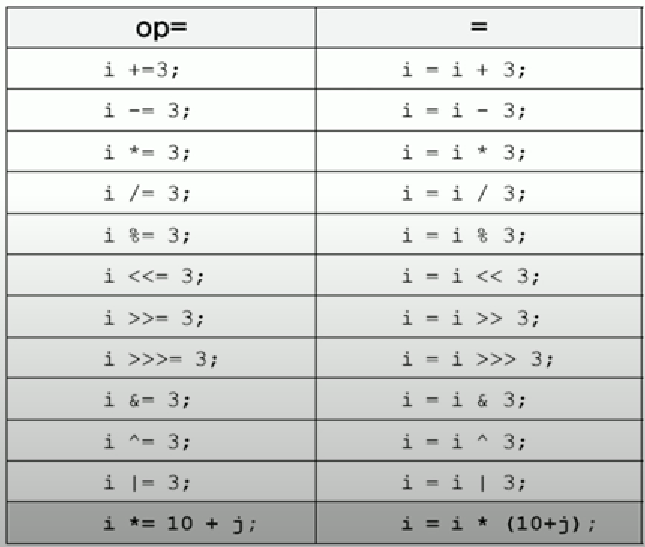

# 제 3장 연산자 ( Operator )

- 중요하다고 생각되는 부분만 우선적으로 정리 

## 연산자의 종류
- 단항 연산자 : + - (타입)  / ++, —, ~, !
- 이항 연산자
  - 산술 : +, -, *, /, %, <<, >>, >>>
  - 비교 : >, < ≥, ≤, ==, ! =
  - 논리 : &&, ||, &, ^, |
- 삼항 연산자 : ? :
- 대입 연산자 : =

## 연산자의 우선순위 

- 괄호의 우선순위가 가장 높음. 
- **산술 > 비교 > 논리 > 대입**
- **단항 > 이항 > 삼항**
- 연산자의 진행방향은 왼쪽에서 오른쪽. 
  - 단, 단항・대입 연산자만 오른쪽에서 왼쪽. 

> **상식적으로 생각했을 때의 우선순위.**

### 몇가지 주의할 우선순위

- <<, >>, >>> 같은 비트연산자의 우선순위는 덧셈연산자보다 낮다. 
- ||, | ( OR )는 &&, & ( AND )보다 우선순위가 낮다. 

> **||와 |, &&와 &의 차이**
> 
> **효율적인 연산 문제( short circuit evaluation )**
> 
> 논리 연산자를 두개 연이어 붙인 연산자(&&, ||)의 경우 왼쪽부터 연산을 시작하여 연산의 결과값이 완전히 나온 경우에는 연산을 더이상 진행하지 않는다. 
> 반면 논리 연산자를 하나만 사용한 연산자(&, |)의 경우에는 왼쪽부터 연산을 시작하여 연산의 결과가 완전히 나온것으로 추정되어도 오른쪽의 값을 계산한다. 
> 
> 예를 들어, ||연산자의 경우 한쪽이 true이면 결과값은 항상 true가 나온다. 그렇기에 ||는 좌측 연산의 결과값이 true이면 우측 연산은 진행하지 않는다. 
> 하지만 |연산자의 경우 왼쪽이 true라고 해도 오른쪽의 연산을 진행한다. ||에 비해 비효율적이다. 
> 
> &&연산자와 &연산자의 경우에도 동일하다. 


## 증감연산자 
- 증가연산자(++), 감소연산자(--)

    ```java
    int i = 5;
    int j = 0;
    ```
  * **전위형**
    * 값이 참조되기 전에 증가시킨다. 
    ```java
      j = ++i; => ++i; j = i;
    ```
  * **후위형**
    * 값이 참조된 후에 증가시킨다. 
    ```java
    j = i; => i++;
    ```
    

## 비트전환연산자
* 정수를 2진수로 표현했을 때 1을 0으로, 0은 1로 바꾼다. 정수형에만 사용 가능
* 음수를 구하는 경우에는 `(비트전환연산자)정수 +1`을 한다
  * 10 => -10 == ~10 + 1

## 이항연산자의 특징
* 이항연산자는 연산을 수행하기 전에 피연산자의 타입을 일치시킨다. 
  * int보다 크기가 작은 타입은 int로 변환한다( byte char short => int)
  > JVM의 피연산자 스택(operand stack)이 피연산자를 4byte 단위로 저장하기 때문에 크기가 4byte 보다 작은 자료형(byte, short)의 값을 계산할 때는 4byte로 변환하여 연산이 수행된다. 
  > 
* 피연산자 중 표현범위가 큰 타입으로 형변환한다 ( 산술변환 )
  - byte + short ⇒ int + int ⇒ int
  - char + int ⇒ int + int ⇒ int
  - float + int ⇒ float + float ⇒ float
  - long + float ⇒ float + float ⇒ float
  - double + float ⇒ double + double ⇒ double


## 삼항연산자
* 그렇게 자주 쓰일일이 있겠나.. 싶긴하지만 if문을 하나 쓸때는 종종 쓸거같다
> 조건식 ? 식1 : 식2
> 
> 조건식이 true이면 식1, false이면 식2
> 

## 대입연산자
* 오른쪽 피연산자의 값을 왼쪽에 저장한다. 
* 단, 왼쪽 피연산자의 값은 상수가 아니어야 한다. => 상수값은 변환불가 

* 참고
